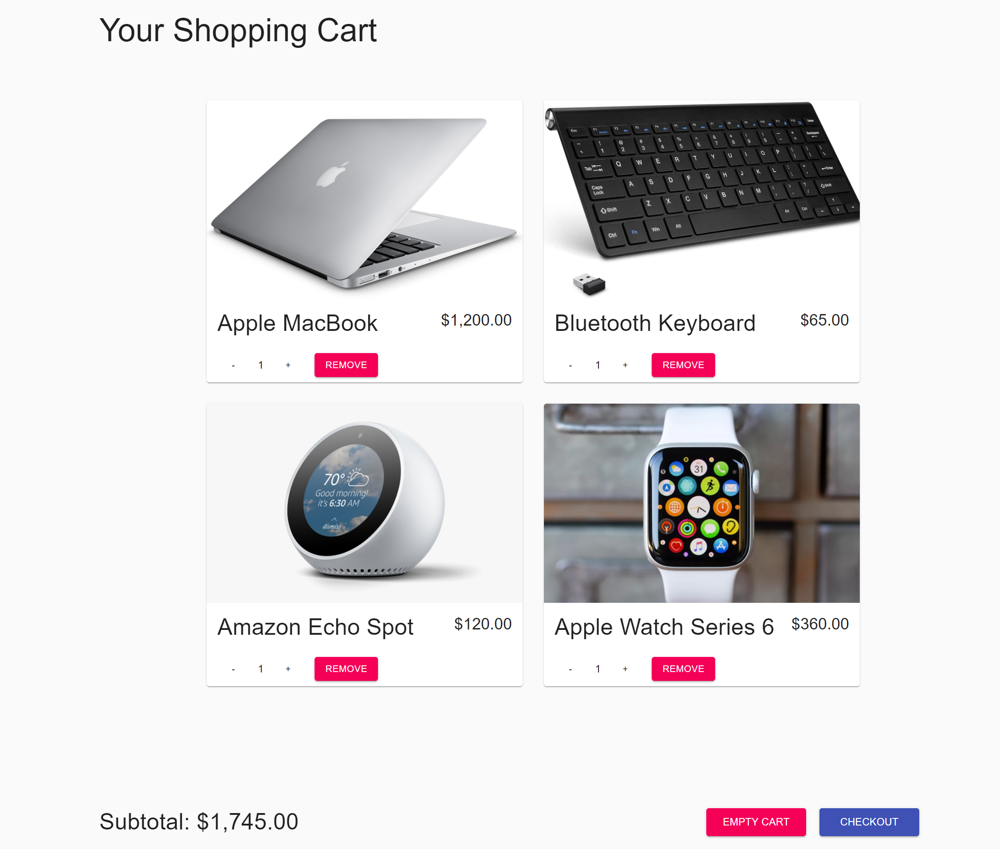
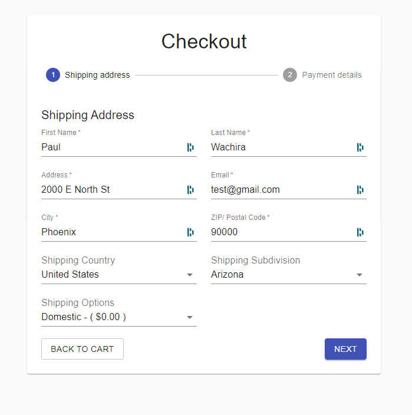
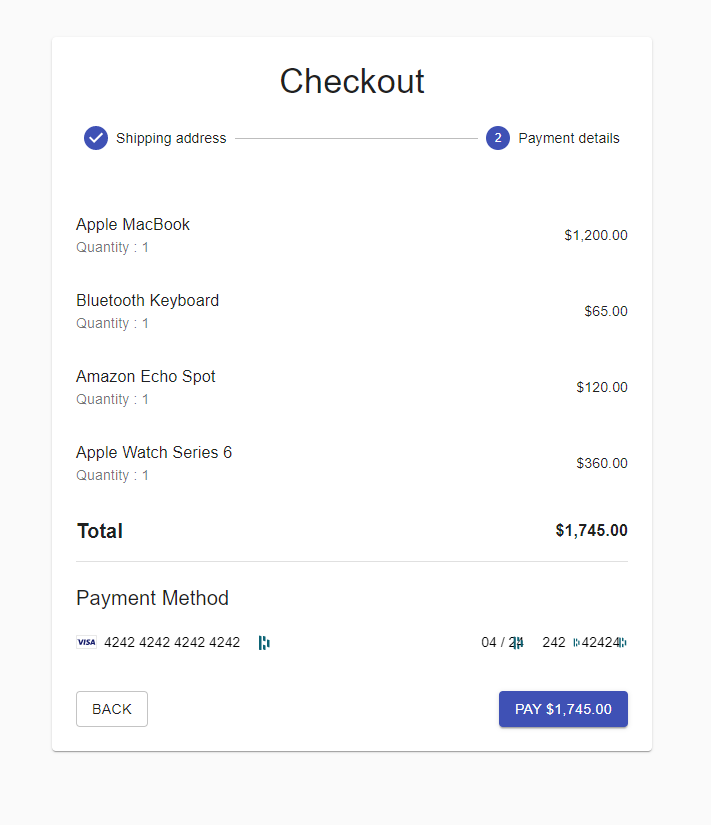
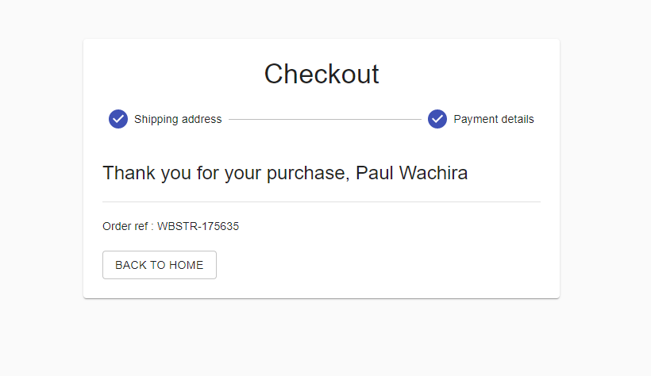
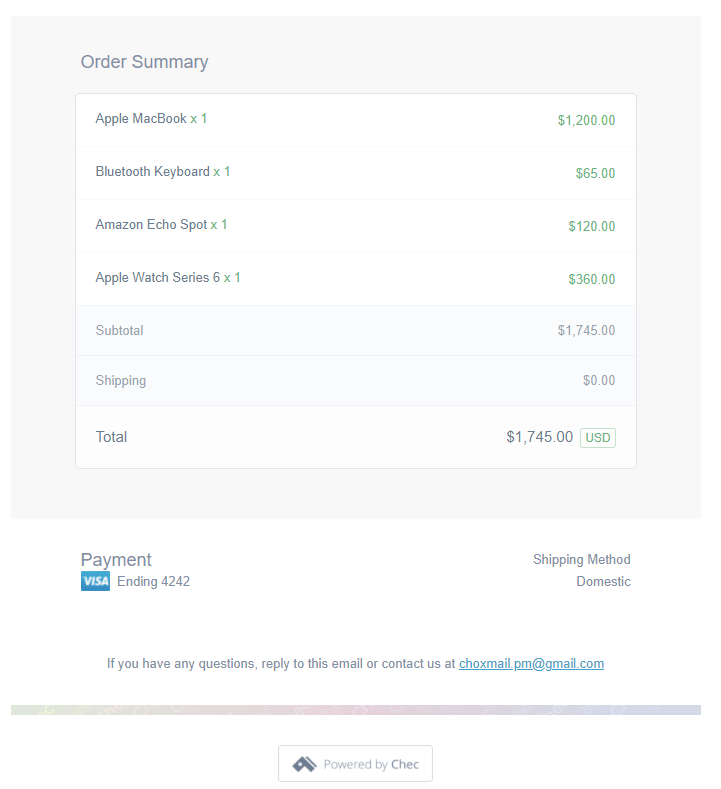

# E-Commerce Web Application
     

---

## Description:
This is a React-based E-commerce application that uses Commerce.js, an e-commerce API to manage products, cart and checkout. The API provides REST-based methods that help fetch, update and delete products and cart items. Checkout allows the user to enter shipping information and once the shipping country is entered, the respective shipping subdivisions and shipping options are pre-populated. Payments are handled through React Stripe.js, a thin wrapper around Stripe and Stripe Elements. Stripe is a library for building payment flows. See the [usage](#usage) or [demonstration](#demonstration) sections for a more detailed explanation on how to use this application.

---

## Table of Contents:
* [Installation](#installation)
* [Usage](#usage)
* [Demonstration](#demonstration)
* [License](#license)
* [Resources](#resources)
* [Future Improvements](#future-improvements)

---

## Installation:
None is required.

---

Steps to use this application:
* __step 1:__ Products are fetched and populated on the home screen.

* __step 2:__ User clicks on the 'add to cart' icon on the items they wish to buy and click on the cart (top right) to view the cart items

* __step 3:__ 

User enters shipping address information and selects their shipping country from the 
drop down menu. Selecting a country prompts an api call to load a list of sub-divisions
of the respective country. The shipping options are also determined by the country selected
ie. whether the shipment will be domestic or international.

* __step 4:__ 

A summary of the checkout items is presented to the user including their total cost.

A stripe element that accepts a user's card details enables the user to make
payments for purcahsed items.

* __step 5:__ 

* __step 6:__ 

---

## Demonstration:
To view a demonstration of this application, go to ==> __[this link](https://react-ecommercejs.netlify.app/)__.

---

## Usage:
At Checkout, under Payment Method, use 424242... for card number, month, year and cvc code. These are stripe defaults.

---

## Resources:
* [CommerceJS](https://commercejs.com/product/ecommerce-api)
	- [CommerJS Products](https://commercejs.com/docs/sdk/products)
    - [CommerceJS Checkout](https://commercejs.com/docs/sdk/checkout)
* [React Stripe.js](https://stripe.com/docs/stripe-js/react)
* [Material-UI](https://material-ui.com/)
* [ReactJS](https://reactjs.org/docs/getting-started.html)
  * [React Hooks](https://reactjs.org/docs/hooks-intro.html)
    - [useState](https://reactjs.org/docs/hooks-state.html)
    - [useEffect](https://reactjs.org/docs/hooks-effect.html)

---

## Future Improvements:
* Use Redux to manage state instead of prop drilling data down several components.
* Allow user to add products from an add_product page, currently can only be done through a commerce.js account
* Use React.useMemo() so that child components don't have to re-render every time their respective parents do. This will further optimize performance.

---

## License:
[MIT License](https://opensource.org/licenses/MIT)

Copyright © 2020 Paul Wachira

Permission is hereby granted, free of charge, to any person obtaining a copy
of this software and associated documentation files (the "Software"), to deal
in the Software without restriction, including without limitation the rights
to use, copy, modify, merge, publish, distribute, sublicense, and/or sell
copies of the Software, and to permit persons to whom the Software is
furnished to do so, subject to the following conditions:

The above copyright notice and this permission notice shall be included in all
copies or substantial portions of the Software.

THE SOFTWARE IS PROVIDED "AS IS", WITHOUT WARRANTY OF ANY KIND, EXPRESS OR
IMPLIED, INCLUDING BUT NOT LIMITED TO THE WARRANTIES OF MERCHANTABILITY,
FITNESS FOR A PARTICULAR PURPOSE AND NONINFRINGEMENT. IN NO EVENT SHALL THE
AUTHORS OR COPYRIGHT HOLDERS BE LIABLE FOR ANY CLAIM, DAMAGES OR OTHER
LIABILITY, WHETHER IN AN ACTION OF CONTRACT, TORT OR OTHERWISE, ARISING FROM,
OUT OF OR IN CONNECTION WITH THE SOFTWARE OR THE USE OR OTHER DEALINGS IN THE
SOFTWARE.

---

## Questions: 
For any questions, please contact:

 

__[paulcmd](https://github.com/paulcmd)__ at wachira.pmw@gmail.com